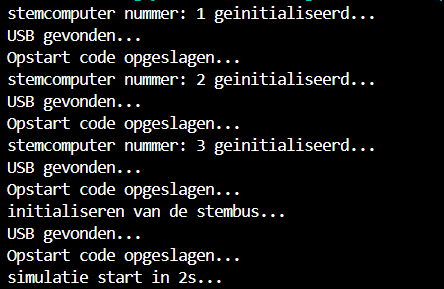
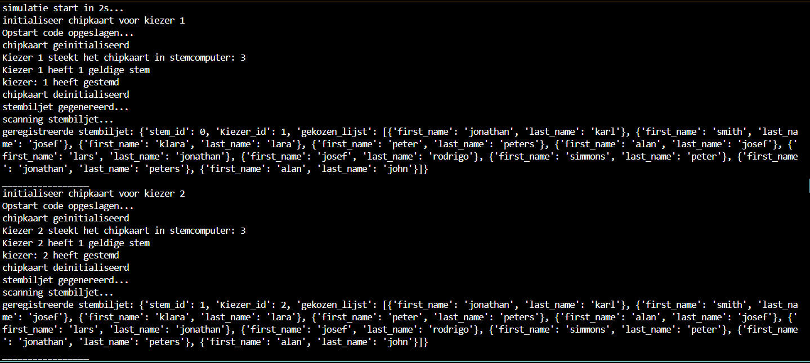
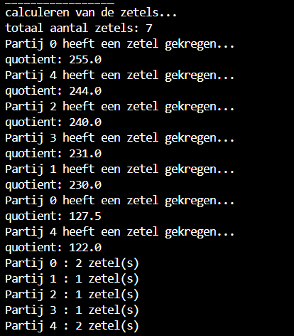

# Objecten initialiseren en creeren

## kiessysteem object
Het kiessyteem object is een klasse dat het geheele stem simulatie beheert.

het wordt geinitialiseert volgens:

    kiessysteem = Kiessysteem(1200, 5)

waarbij de eerste waarde het aantal kiezers is dat je wilt initialiseren en de tweede waarde het aantal partijen is.

### Initialisatie van het kiessysteem object:
#### USB
Het USB object wordt geïnitialiseerd bij het aanmaken van het Kiessysteem object in de dunderinit methode. Het krijgt willekeurig een 9 digit opstartcode toegewezen bij initialisatie.

#### Rest van de objecten
Nadat de USB is geinitialiseerd worden de volgende objecten gecreerd:
1. 1 Stembus object
2. Een lijst van 1200 kiezers objecten
3. Een lijst van 5 partij objecten met elks een lijst van 10 kandidaten
4. Een lijst met 3 stemcomputer objecten

Output van de console:

## Stem process simulatie

## zetel verdeling 

