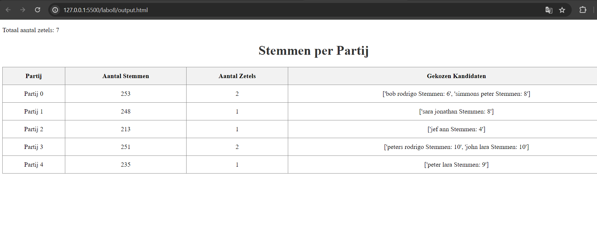

github link: https://github.com/LukaWynants/Kiessysteem 

# Install dependencies

    pip install Jinja2

# Objecten initialiseren en creeren

## kiessysteem object
Het kiessyteem object is een klasse dat het geheele stem simulatie beheert.

het wordt geinitialiseert volgens:

    kiessysteem = Kiessysteem(1200, 5)

waarbij de eerste waarde het aantal kiezers is dat je wilt initialiseren en de tweede waarde het aantal partijen is.

### Initialisatie van het kiessysteem object:
#### USB
Het USB object wordt geïnitialiseerd bij het aanmaken van het Kiessysteem object in de dunderinit methode. Het krijgt willekeurig een 9 digit opstartcode toegewezen bij initialisatie.

#### Rest van de objecten
Nadat de USB is geinitialiseerd worden de volgende objecten gecreerd:
1. Een Stembus object die de stembiljet objecten zal beheren
2. Een lijst van 1200 kiezers objecten
3. Een lijst van 5 partij objecten met elks een lijst van 10 kandidaten
4. Een lijst met 3 stemcomputer objecten
5. Een lijst van 60 chipkaart objecten

#### Output van de console:

## Stem process simulatie

Nadat het kiessyteem object is geinitialiseerd wordt de start_stem_simulatie methode geropen met:

    kiessysteem.start_stem_simulatie()

De stemsimulatie methode begint met een while loop die controleert of het self.gestemd attribuut voor alle kiezers de waarde True heeft.

### Wat gebeurt er in deze loop:

1. Een Kiezer object en een Chipkaart object worden gekozen.
2. Het Chipkaart object wordt geïnitialiseerd met de opstartcodes.
3. De kiezer kiest een willekeurige Stemcomputer.
4. De Stemcomputer controleert of de opstartcode van de chipkaart overeenkomt met de opstartcode die hij van de USB heeft ontvangen.
5. Een willekeurige partij wordt gestemd door de kiezer.
6. Er wordt een opgestelde lijst of een willekeurig samengestelde lijst gekozen (met een kans van 50/50), de top kandidaat van de gekozen lijst krijgt een punt.
7. Een Stembiljet object wordt gecreëerd.
8. Het Chipkaart object wordt gedeïnitialiseerd.
9. Het stembiljet wordt dan gescanned met het scanner object warbij:

        a. Het stembiljet in de stembus word geregristreed

        b. Het stembiljet wordt getoond aan de kiezer

#### Output van de console:

## zetel verdeling 

De zetels worden berekend met de D'Hondt methode

source: https://en.wikipedia.org/wiki/D%27Hondt_method#:~:text=most%2Doverrepresented%20party.-,Example,from%20100%2C000%20down%20to%2025%2C000

### Berekening van de Quotienten voor Elke Partij:

1. Het aantal stemmen voor elke partij wordt gedeeld door 1, 2, 3, ..., n zetels.
2. Deze berekende quotienten worden toegevoegd aan een dictionary, samen met hun respectieve partij.
3. Deze dictionary wordt toegevoegd aan een lijst van alle berekeningen voor alle partijen.

### Toekenning van Zetels op Basis van de Hoogste Quotienten:

1. De n hoogste quotienten worden geselecteerd, waarbij n de aantal zetels is.
2. De partijen die bij de n hoogste quotienten horen, krijgen een zetel toegewezen.

#### Output van de console:

#### Zetels verdelen aan de kandidaten:

1. De Kandidaten die het meest aan de top van het lijst waren zijn berekend, en de een lijst is gemaakt met deze volgorde
2. De top n aantal kandidaten worden gekozen om een zetel te krijgen op basis van de zetel verdeling van hierboven.

### HTML output

Voor de html output heb ik de jinja2 library gebruikt, een output.html wordt gerendered van het /templates/template.html bestand waarin variabelen staan voor de Partij, aantal stemmen en aantal zetels en welke kandidaten de zetels krijgen.

#### Output.html:

