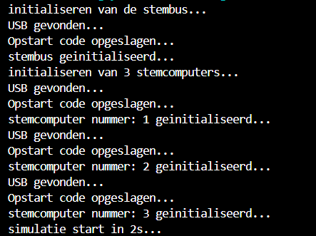

# Objecten initialiseren en creeren

## kiessysteem object
Het kiessyteem object is een klasse dat het geheele stem simulatie beheert.

het wordt geinitialiseert volgens:

    kiessysteem = Kiessysteem(1200, 5)

waarbij de eerste waarde het aantal kiezers is dat je wilt initialiseren en de tweede waarde het aantal partijen is.

### Initialisatie van het kiessysteem object:
#### 1. usb
De usb wordt geintialiseerd bij het initialisatie van het kiessyteem object
### 2. 

